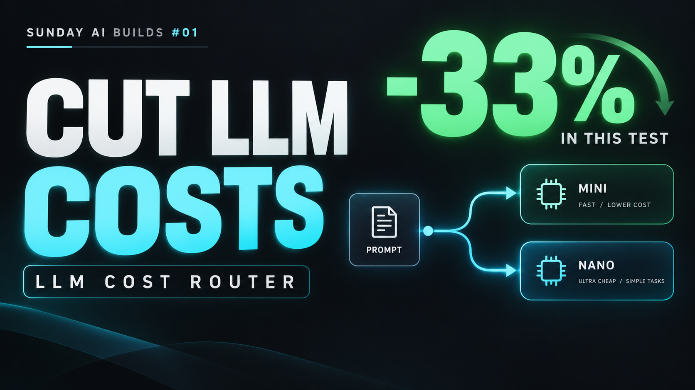
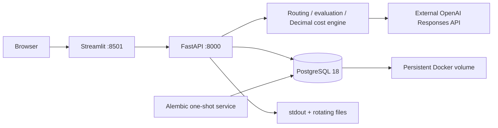

# 💸 LLM Cost Router · AI FinOps Calculator

[](https://youtu.be/V6WkuI0yDXc)

[](https://youtu.be/V6WkuI0yDXc)
[](https://www.linkedin.com/in/w-e-ll/)

**▶ [Watch the full project walkthrough · Sunday AI Builds #01](https://youtu.be/V6Wkul0yDXc)**  
**Contact:** [Valentin Sheboldaev · LinkedIn](https://www.linkedin.com/in/w-e-ll/)


**Your AI architecture is also a financial architecture.**

Sunday AI Builds #01 compares a baseline model policy with simple/complex routing using real OpenAI responses, then projects costs from a saved experiment ID.
Python, dependencies, API, UI, migrations and PostgreSQL run in Docker. OpenAI inference remains an external paid API.

## ✨ Core features

- Compare GPT-4.1-mini for all tasks with nano for simple tasks and mini for complex tasks.
- Record provider-reported input/output/cached tokens, measured latency and estimated USD cost.
- Bound experiments with a conservative preflight reserve and eligible fallback.
- Persist experiment IDs and final results in PostgreSQL.
- Calculate cost/request, day and month, savings and budget coverage from a completed run.
- Correlate requests, routing, model attempts and database writes through application logs.

## 🧭 Architecture



Compose waits for database readiness, applies migrations, starts the API, then the UI.
The UI receives no OpenAI key or database password. The app uses a non-superuser database role.
Integration tests use a separate database.

## ⚡ Quick start · Windows / PyCharm

Prerequisite: Docker Desktop running Linux containers. Docker execution requires no host Python or PostgreSQL.

The lifecycle script also detects Docker Desktop's installed credential helper if a stale PyCharm/PowerShell PATH does not include it.

```powershell
cd C:\Users\valen\projects\llm-cost-router
.\scripts\docker.ps1 Setup
```

Edit the local `.env` and set `OPENAI_API_KEY` for paid experiments. Setup generates database passwords and preserves an existing key. Never commit this file.

**Existing native PostgreSQL users:** stop PyCharm API/UI processes and close database clients, then follow the migration section **before Up**.
Otherwise Up creates tables and automatic restore correctly refuses to overwrite them.

**Fresh installation:**

```powershell
.\scripts\docker.ps1 Up
```

| Service | Address |
|---|---|
| Dashboard | http://127.0.0.1:8501 |
| API docs | http://127.0.0.1:8000/docs |
| Database readiness | http://127.0.0.1:8000/health/db |
| Host database access | 127.0.0.1:5434, database llm_cost_router, user llm_router |

Stop old PyCharm run configurations to free ports 8000/8501, or change `API_PORT` / `UI_PORT` in `.env`.
Database host port 5434 avoids the old native port during migration.

## 📦 Existing native database migration

```powershell
.\scripts\docker.ps1 MigrateNative
.\scripts\docker.ps1 RemoveNative
```

Migration dumps the database into `var/backups/native-migration`, restores into an empty Docker database,
compares complete run/plan rows and checks persistence after a container restart.
Native PostgreSQL stops only after restore verification.
RemoveNative requires a verified backup checksum, matching Docker records and a stopped native server.
It deletes only this project's `var/postgres`, retaining the backup.

Do not run `docker compose down -v`: it deletes persistent volumes.
See [Docker operations](docs/docker.md) for failure recovery.

## 🎬 Demo workflow · inputs and outputs

1. Open **Live OpenAI experiment**. Select baseline/simple/complex models, task count, fallback, budget and latency SLA.
2. **Prepare** shows the reserve and maximum call count without a paid request.
3. Explicitly run the paid experiment. Results include its UUID, policy comparison, usage, estimated costs, correctness and latency.
4. Choose **Use this run for planning**, or paste a completed run ID into **Cost planning**.
5. Enter monthly volume, days/month and budget. Results include daily/monthly cost, savings, affordable volume and a saved plan UUID.

Planning makes no OpenAI calls. Task complexity labels and expected answers are predefined.
Exact-match correctness measures only this toy dataset. Rates are dated snapshots saved with each experiment;
provider billing remains the source of truth. Sample p95 and extrapolated monthly cost do not establish production behavior.
The synthetic comparison endpoint remains in API docs and logs explicitly as simulation.

## 📂 Project structure

```text
llm-cost-router/
├── llm_cost_router/
│   ├── api/              # HTTP validation, experiments, planning, health
│   ├── core/             # Cost logic, live execution, shared logger
│   ├── db/               # SQLAlchemy schema, repository, legacy import
│   └── ui/               # Streamlit HTTP client
├── migrations/           # Alembic schema revisions
├── docker/init-db.sh     # App role and separate app/test databases
├── scripts/docker.ps1    # Windows lifecycle and verified migration
├── tests/
├── docs/
├── var/backups/          # Private local backups, ignored by Git/Docker
├── Dockerfile
├── docker-compose.yml
├── .dockerignore
├── .env.example
├── pyproject.toml
├── uv.lock
├── VERSION.txt
├── DECISIONS.md
└── CHANGELOG.md
```

The supplied CodeScope files are style references. Their secrets and unrelated settings are not copied.
[Every project file explained](docs/project-files.md).

## 🛠️ Stack and tradeoffs

| Layer | Choice | Tradeoff |
|---|---|---|
| UI / API | Streamlit / FastAPI | Fast Python development; synchronous live experiments |
| Storage | PostgreSQL, JSONB, Alembic | Auditable snapshots; larger analytics may need normalization |
| Money | Decimal | Explicit serialized decimal strings |
| Inference | OpenAI through HTTPX | Actual usage; external cost and provider dependency |
| Packaging | Python 3.13, frozen uv.lock | Locked Python dependencies; image tags can receive updates |
| Operations | Compose, probes, rotating logs | Local deployment, not a managed production platform |

No Redis or pgvector is required for experiment records and financial projections.
[Technical decisions](DECISIONS.md).

## 📈 Monitoring

```powershell
.\scripts\docker.ps1 Logs
docker compose logs --since 10m api
docker compose exec api sh -c 'tail -n 50 /app/var/logs/api.log'
```

The log layout follows the example: timestamp, PID, level, module, plus event fields and request/run IDs.
Use `LOG_FORMAT=json` for ingestion. Files rotate at 20 MiB with ten backups; Docker stdout has separate 20 MiB/five-file rotation.
[Event catalog and troubleshooting](docs/logging.md).

## 🧪 Tests

```powershell
.\scripts\docker.ps1 Test
```

The test image includes development dependencies. Real PostgreSQL tests create random schemas in
`llm_cost_router_test`, apply Alembic and clean up afterward. Provider responses are mocked; tests make no paid calls.
Health checks do not verify OpenAI billing or credentials.

For host/PyCharm development, run `uv sync`, configure host database URLs using the Docker app password and port 5434,
then `uv run pytest` and `uv run ruff check .`. Docker runtime does not need those host tools.

## 🔧 Daily operations

```powershell
.\scripts\docker.ps1 Up       # Build and start healthy services
.\scripts\docker.ps1 Verify   # Readiness checks, no model calls
.\scripts\docker.ps1 Down     # Preserve volumes
```

Add an Alembic revision for schema changes and rebuild with Up.
Initialization scripts affect only fresh database volumes.
Changing passwords in `.env` does not rotate existing database role passwords.

## 🚧 Production improvements

Authentication, authorization, distributed jobs, interrupted-run recovery, external secret management,
tested off-machine backups, retention policies, larger evaluation datasets and metrics/tracing are future work.
Logging is implemented; an alerting dashboard is not bundled. Local ports bind to loopback.

## 📚 Documentation

- [Architecture](docs/architecture.md)
- [Live experiments](docs/live-experiment.md)
- [Docker operations](docs/docker.md)
- [Logging](docs/logging.md)
- [Project files](docs/project-files.md)
- [Decisions](DECISIONS.md) · [Changelog](CHANGELOG.md)
