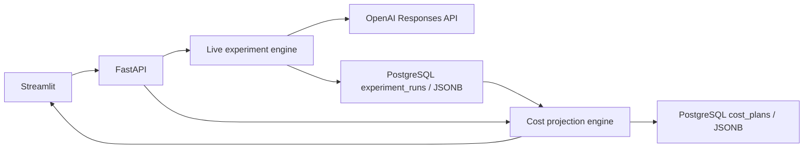

# Architecture and development plan

## Docker runtime (0.2.0)

Compose runs PostgreSQL 18.6, one-shot Alembic migrations, FastAPI and Streamlit.
UI uses `http://api:8000`; API uses `db:5432`. Python dependencies come from uv.lock.
Named volumes store database data and separate API/UI rotating logs. Tests use a separate database.
Host ports bind to loopback: 8000, 8501 and database 5434.

Application events cover routing, attempts, costs, budget rejection and committed database writes.
Request/run IDs correlate records; prompts, answers and credentials are omitted.
See [Docker operations](docker.md), [logging](logging.md) and [decisions](../DECISIONS.md).
Native PostgreSQL is transitional and removed only after verified migration.

## User flow

**Live experiment → saved run ID → cost planning.** The dashboard opens on Live OpenAI experiment.
A completed result has a **Use this run for planning** button. The planner also accepts a pasted ID.

Only the live execution path calls OpenAI. Planning loads a stored result through the API, validates
it, and computes projections. Streamlit collects settings and renders responses; it owns no money
calculations. Decimal is used internally and money is serialized as strings.

## Modules

- `core/live.py`: fixed evaluation dataset, dated prices, preflight, Responses adapter and evaluation.
- `api/live.py`: config, estimate, paid run and saved-run retrieval; key remains in backend environment.
- `core/planning.py`: validated source-run data and pure projection formulas.
- `api/planning.py`: loads run by validated UUID and exposes `POST /api/v1/planning`.
- `db/`: SQLAlchemy PostgreSQL repository, connection settings and insert-only legacy import.
- `migrations/`: Alembic versioned schema migrations; no automatic table creation on API startup.
- `scripts/docker.ps1`: Docker lifecycle, verified migration and native removal.
- `scripts/postgres.py`: legacy native recovery helper; not the default deployment.
- `ui/app.py`: landing page and navigation.
- `ui/live_ui.py`: preparation, execution, results and planning shortcut.
- `ui/planning_ui.py`: source ID, volume/budget settings, provenance and downloadable projections.
- `core/engine.py`, `core/schemas.py`: original simulator, retained behind legacy API endpoints.

## Stored experiment

`experiment_runs` stores a UUID primary key, status, creation/update timestamps, configuration JSONB
and the full result JSONB. The snapshot includes prices, dataset version, attempts, answers, usage
and timing. Decimal costs remain strings inside JSONB, preserving the existing API contract.

Before paid calls, INSERT ON CONFLICT DO NOTHING reserves the ID and commits. Only the winning
claimant runs the provider. No transaction is held open while waiting on OpenAI. Finalization updates
only a `started` record. Completed results are immutable through the repository API. An interrupted
run is not automatically retried; unknown execution failures are recorded as failed when possible.
If final persistence fails, the committed started record still prevents another paid execution.

`cost_plans` stores a UUID, a restrictive foreign key to the source run, settings JSONB, result JSONB
and creation timestamp. Each submitted plan creates a snapshot. GET by plan ID retrieves it.
Indexes support recent-run listing and source-run lookups. There is no file/SQLite fallback.

The live route also uses a process lock; database uniqueness protects the same ID across workers.
Different IDs are independent, and the per-run budget is not an account budget. Legacy JSON imports
insert missing IDs only and retain source files. See [Windows setup](postgres-windows.md) and
[the experiment guide](live-experiment.md).

## Planning inputs and validation

API input: run UUID, monthly requests (0–10 million), days/month (1–31), monthly budget in USD.
Only the ID is sent for source selection; clients cannot replace recorded usage or model prices.

The saved run must be live and completed. Both policies must contain the configured number of
unique matching task IDs and complexity labels. Every attempt must have finite, nonnegative costs
and complete token counts, with cached tokens no larger than input tokens. Missing runs return 404,
unfinished runs 409, and invalid input/source data 422.

Planning does not require an OpenAI key, perform provider calls, rerun the dataset or write the source.

## Projection formulas

For each policy:

- Sample cost = sum of recorded attempt costs, including executed fallback attempts.
- Cost per request = sample cost / number of sample tasks.
- Monthly cost = cost per request × requested monthly volume.
- Daily cost = monthly cost / selected days per month.
- Budget gap = max(0, monthly cost − monthly budget).
- Estimated affordable requests = floor(monthly budget / average request cost).
- Savings = projected baseline monthly cost − projected routed monthly cost.

Zero observed cost yields no affordable-request estimate rather than claiming infinite capacity.
Zero baseline monthly cost yields no percentage savings. Negative savings are allowed.

Token averages include all attempts per task. Models are taken from recorded attempts, and source
settings and prices are exposed alongside the results. Current catalog changes never reprice an old
run. Accuracy, failures, fallback count and nearest-rank p95 are displayed as historical measurements.
No production accuracy, availability or latency is inferred from increased request volume.

## Assumptions and limits

Projection preserves source workload mix, token lengths, caching and fallback behavior. These can
change at production volume. Budget coverage uses average cost and is not a live admission policy.
Small sample p95 is unstable. Correctness is exact-match on a small task set, not a general benchmark.

## Next stages

1. Named scenarios and richer run history on the implemented PostgreSQL/SQLAlchemy/Alembic foundation.
2. Larger representative datasets, repeated runs, distribution summaries and routing quality evaluation.
3. Production gateway: authentication, tenant isolation, atomic quota reservation, bounded retry,
   circuit breakers, idempotency and observability.
4. Semantic caching: embeddings and pgvector when needed for Sunday Build #02.

Redis and pgvector are unnecessary for the current live-run-to-projection workflow.

## Local workflow

Use the same project in PyCharm and Codex. Keep changes small, review diffs and run `uv run pytest`
and `uv run ruff check .` after business logic changes. Tests mock OpenAI: no paid calls are made.
